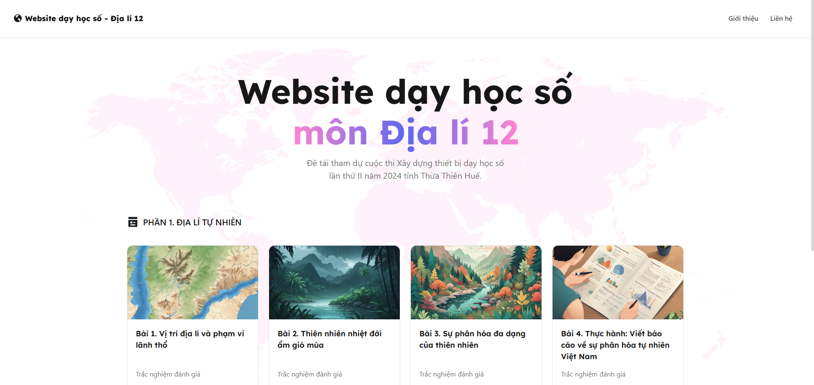

# Digital learning website for Geography 12
Project submission for the 2nd Digital Learning Equipment Development Competition in 2024, Thua Thien Hue province.

## 📍 Features
- Learning with embed PowerPoint slides
- Assessment test after each lesson with answer check

## 📃Example
<p>
  
  
</p>
<p>
  
  
</p>
<p>
  
</p>

## 🛠️ Built with
- Javascript (ReactJS)

## ⚙️ Installation
### 1. Clone repository
```bash
git clone https://github.com/zoohuyvn/websitedayhocdialy12phuloc.git
```
### 2. Install environment
- Node.js v22.11.0
    - [Windows](https://nodejs.org/dist/v22.11.0/node-v22.11.0-x64.msi)
    - [macOS](https://nodejs.org/dist/v22.11.0/node-v22.11.0.pkg)
### 3. Open in IDE
You can open the project with an IDE like IntelliJ IDEA, Visual Studio Code, etc. Here I use [VS Code (v1.95)](https://code.visualstudio.com/sha/download?build=stable&os=win32-x64-user).<br>
Open VS Code, click `File/Open Folder` and browse to directory you cloned.

## 👉 Usage
Access to project folder, then run:<br>
```bash
npm i
```
```bash
npm start
```
Website will run on default url: [`http://localhost:3000`](http://localhost:3000).

## 🫂 Contributing
If you'd like to contribute, fork the repository and use a feature branch.

## 📄 License

## 🥹 Acknowledgments
I'm look forward to receiving feedback as I develop further. Thanks for viewing my project ✨.

## ✨ Support
Give a ⭐ if this project helped you!<br><br>
<a href='https://www.buymeacoffee.com/zoohuyvn' target='_blank'></a>